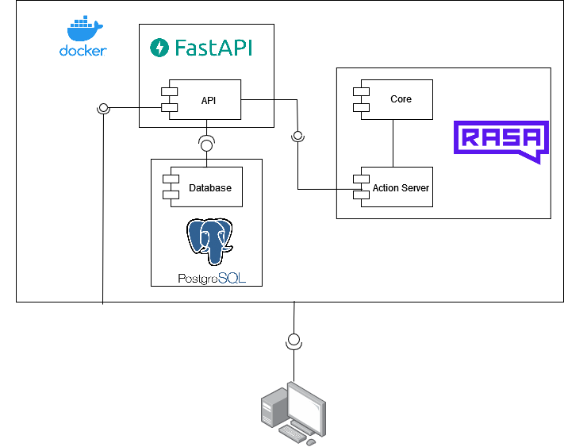
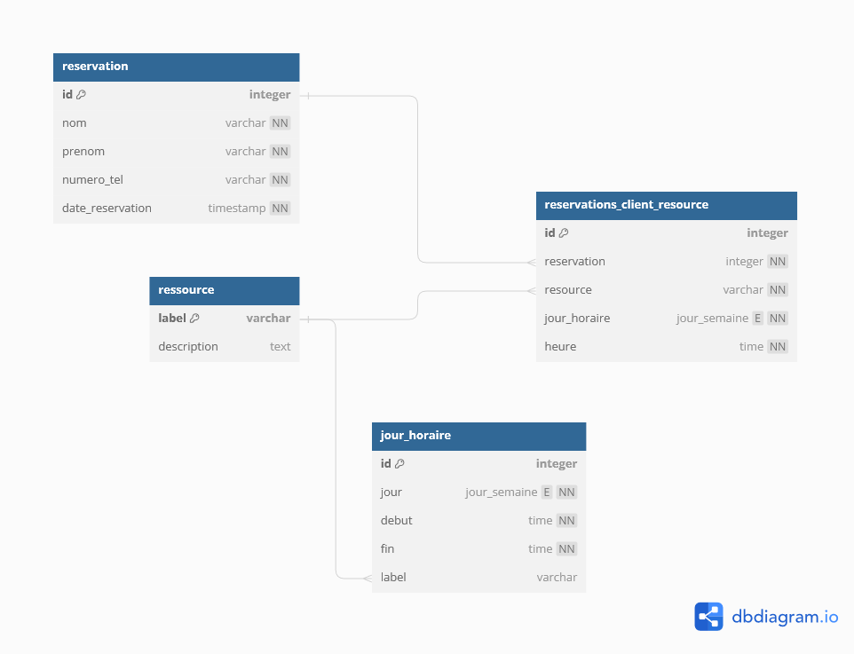
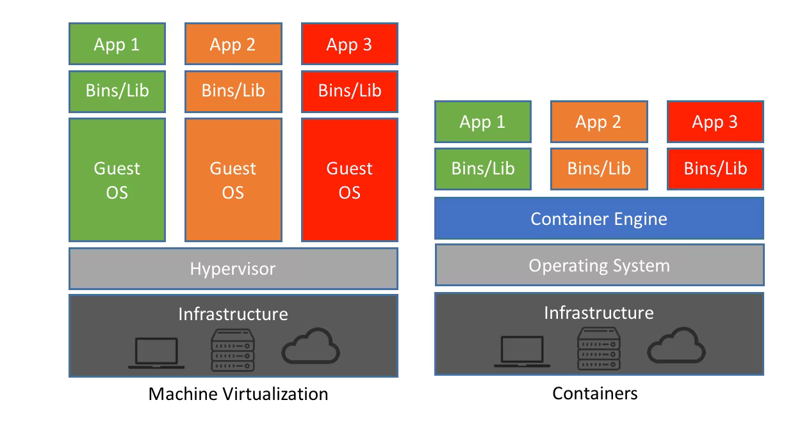
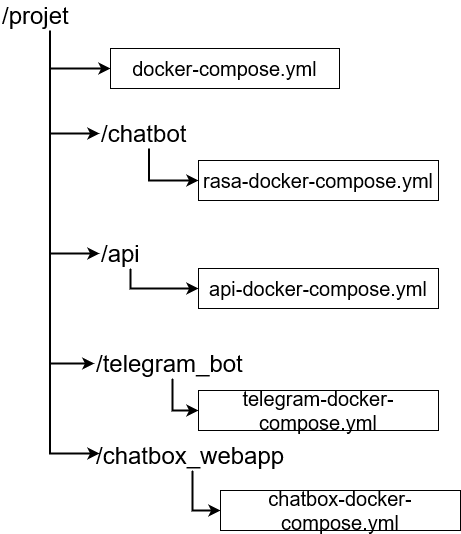

# Documentation Technique

(Ce fichier est temporaire et sert à rédiger sans prendre en compte la forme)

## Architecture Générale



## Composants

- Postgresql

### Base de données

#### Diagramme relationnel

Afin de pouvoir enregistrer les divers informations en lien avec des réservations, une base de données Postgresql est disponible.



Lors de l'initialisation du Bot, à l'aide d'un script fournit, il est possible de remplir aisément les tables nécessaires au fonctionnement de l'application : 

1. jour_horaire: Contient les heures de début-fin par tranches d'heure pour une ressource donnée
2. ressource: Un nom de ressource avec une description optionnellement
3. options_resource: Associe une option et description a une ressource
4. options_resource_choix: Associe un choix à une option

Par la suite, les tables suivantes sont régulièrement utilisées pour réserver une ressource :

1. reservation: Contient les informations du client ayant effectué une réservation
2. reservations_client_resource: Définit quelle ressource a été réservée, à quelle heure/date et associé à quelle réservation
3. reservations_client_choix: Enregistre, si la ressource choisie en possède, les choix effectués lors de la réservation par le client
4. temp_reservation: Lorsqu'un client est en train de réserver, la ressource à la date et heure donnée seront pré-réservées pendant un temps limité afin d'éviter des réservations simultanées

#### Script d'insertion de données

Lorsque la base de données est démarrée, il est possible d'y insérer facilement les données requises à la réservation grâce à un script python nommé `data_insert.py` dans `/projet/db/scripts/` .

Concernant son usage, il suffit de remplir/insérer des fichiers .csv dans le dossier `data`. Il est nécessaire cependant de s'assurer que les fichiers contiennent les mêmes colonnes, dans le même ordre et portant le même nom que les colonnes dans la base de données car sinon l'insertion de données ne fonctionnera pas, d'où l'utilité de suivre un template de csv fournit. 

Pour insérer un fichier il ne suffit que d'ajouter une ligne similaire à cela dans le code 

```python
process_csv("ressource.csv","ressource")
```

*En premier, le nom du fichier; en second, le nom de la table dans la base de données*

### API

- FastAPI
- Uvicorn
- SQLAlchemy

Une API (Application Programming Interface) a pour but de mettre à dispositions divers fonctionnalités et services sans pour autant qu'il soit nécessaire de les télécharger comme dans le cas de packages. Dans ce projet, nous avons donc mis en place une API réalisée en Python avec FastAPI et fonctionnant grâce à Uvicorn. 
Une API est généralement un URL auquel on envoie des requêtes et de laquelle on reçoit des informations en retour. Dans notre cas, il existe une multitude de routes sous la forme suivante : 

```python
@app.get("/get-reservations-ressources-from-date/{ressource}/{date}")
async def get_reservations_ressources_from_date(ressource:str,date:datetime.date):
		...
        return JSONResponse(content=jsonable_encoder(query),status_code=status.HTTP_200_OK)
```

La route ci-dessus permet de récupérer des réservations selon une date et ressource fournie dans l'URL directement et renvoie comme contenu la réponse de la requête à la base de données

L'API est constituée des routes suivantes:


Afin de simplifier les interactions avec la base de donnée depuis l'API, SQLAlchemy est employé pour mettre en place une couche d'ORM (Object-relational-mapping) qui en quelques mots permet d'éviter de devoir rédiger chaque requête manuellement et de simplement utiliser des fonctions d'objet de manière chaînées pour les requêtes.

Un exemple : 
```python
query = session.query(Jour_Horaire.jour).where(Jour_Horaire.label.like(ressource_label)).where(Jour_Horaire.debut <= heure).where(Jour_Horaire.fin>=heure).distinct().all()
```

Est équivalent à :

```sql
SELECT DISTINCT jour FROM Jour_Horaire WHERE label like ressource_label AND debut <= heure AND fin >= heure;
```

Bien que la requête soit plus longue avec de l'ORM, elle est plus rapide à écrire et bien plus facilement modulable que de devoir changer manuellement un string contenant la requête SQL

De plus, si l'on souhaite ajouter un nouvel élément dans la table, on peut faire usage des classes créées au préalable pour ajouter très facilement une nouvelle réservation par exemple : 

```python
class Reservation(Base):
    __tablename__ = 'reservation'
    id = Column(Integer(),primary_key=True,autoincrement="auto")
    nom = Column(VARCHAR(),nullable=False)
    prenom = Column(VARCHAR(),nullable=False)
    numero_tel = Column(VARCHAR(),nullable=False)
    date_reservation = Column(TIMESTAMP(),nullable=False)
    
new_reservation = Reservation(nom=data.nom,prenom=data.prenom,numero_tel=data.numero_tel,date_reservation=datetime.datetime.now(ZoneInfo('Europe/Paris')),)
with Session.begin() as session:
    session.add(new_reservation)
    session.flush()
    session.refresh(new_reservation)
```

Ci-dessus, on voit donc qu'il ne suffit que de créer une nouvelle instance de l'objet réservation, la remplir et ensuite l'ajouter à la base de données. Le `flush` et `refresh` permettent simplement d'immédiatement effectuer la requête et de mettre à jour l'objet local new_reservation en mettant à jour l'ID nouvellement affecté par la base de données.

### Rasa

Le framework Rasa est le composant central de ce projet car permettant la réalisation du chatbot en lui-même. Ce dernier est divisé dans ce projet en deux sous-composants :

- Rasa Core
- Rasa Action Server

#### Rasa core

Rasa Core comporte toute la logique du Chatbot et la configuration de ce dernier. 


Dans l'image ci-dessus on peut voir l'essentiel des fichiers qui forment le Core du Chatbot de ce projet. Il est important de noter qu'il est aussi possible de faire que 2 fichiers dans lequel est regroupé l'ensemble des éléments présents dans ces divers fichiers mais le fait de les subdiviser rends la logique plus compréhensible et le "code" plus facile à lire.

Afin de démontrer un fonctionnement basique du Chatbot, voici un extrait du code du Chatbot: 

```yaml
  - story: goodbye
    steps:
      - intent: goodbye
      - action: utter_aurevoir
      - action: action_restart

  - intent: goodbye
    examples: |
      - aurevoir
      - au revoir
      - bye
      - adieu
      - adieux
      - bonne soirée
      - bonne journée
      
   responses:
      utter_aurevoir:
		  - text: "Au revoir!"
```

Ci-dessus, on peut observer les quelques éléments nécessaires au fonctionnement d'une story basique. Dans ce cas, lorsque l'utilisateur envoie un mot semblable au jeu de donnée présent dans l'intention ***goodbye***, le Chatbot va ensuite répondre ``Au revoir!`` et finalement remettre à zéro tous les slots modifiés et réinitialiser la logique conversationnelle avec la client.

Un extrait de la story principale du chatbot qui revient souvent est celle utilisant un ***form***. 

```yaml
stories:
	- story: selection_ressource
	  ...
 	  - action: get_date_heure_form
      - active_loop: get_date_heure_form
      - slot_was_set:
          - date: "20/05/2024"
      - slot_was_set:
          - heure: "12h23"
      - slot_was_set:
          - accept_deny: true
      - slot_was_set:
          - requested_slot: null
      - active_loop: null
      - action: utter_date_heure
      ...
rules:
	- rule: Submit Form Date Heure
	  condition:
	  - active_loop: get_date_heure_form
	  steps:
        - action: get_date_heure_form
        - active_loop: null
        - slot_was_set:
          - requested_slot: null
        - action: utter_date_heure
        - action: reset_validation
        - action: get_info_reserv_form
        - active_loop: get_info_reserv_form
	  wait_for_user_input: false

```

Si on analyse l'extrait ci-dessus, lorsque le bot récupère les divers informations pour une réservation, vient le moment où est demandé quand l'utilisateur veut réserver. C'est à ce moment là que l'on va rentrer dans un form qui on le rappelle a pour but de garder l'utilisateur dans une boucle de questions tant qu'il ne fournit pas les informations requises ou qu'il annule. Dans l'extrait ci-présent, l'utilisateur va fournir (l'ordre importe peu) une date, une heure et valider. La boucle sera ensuite désactivée et l'heure et date seront annoncés

Afin d'assurer le bon fonctionnement de la logique, il est d'usage d'employer des règles pour affirmer la suite d'actions définies. 

Un détail qui n'est pas visible directement dans les stories sont des actions exécutées automatiquement si elles possèdent un nom spécifique.

- action_ask_\<nom form\>\_\<nom slot\>: Texte envoyé à l'utilisateur lorsque le bot tente de récupérer l'information en lien avec le slot courant allant être rempli
- validate_<nom_form>: Nom d'une action qui est plus généralement définie en tant que classe dans le fichier `actions.py` qui va permettre de définir des fonctions servant à valider chaque slot `validate_<nom slot>`

Le code lié à ces actions est le suivant : 

```python
class AskForHeureAction(Action):
    def name(self) -> Text:
        return "action_ask_heure"

    def run(
        self, dispatcher: CollectingDispatcher, tracker: Tracker, domain: Dict
    ) -> List[EventType]:
		...
        return []
    
class AskForDateAction(Action):
    def name(self) -> Text:
        return "action_ask_date"

    def run(
        self, dispatcher: CollectingDispatcher, tracker: Tracker, domain: Dict
    ) -> List[EventType]:
		...
        return []
    
class ValidateHeuresForm(FormValidationAction):
    def name(self)->Text:
        return "validate_get_date_heure_form"
    
    def validate_date(
        self,
        slot_value: Any,
        dispatcher: CollectingDispatcher,
        tracker: Tracker,
        domain: DomainDict,
    ) -> Dict[Text, Any]:
        ...
        return {"date": date_duckling}
    
    def validate_heure(
        self,
        slot_value: Any,
        dispatcher: CollectingDispatcher,
        tracker: Tracker,
        domain: DomainDict,
    ) -> Dict[Text, Any]:
        ...
        return {"heure": heure_duckling,"accept_deny":None}
        
    def validate_accept_deny(
        self,
        slot_value: Any,
        dispatcher: CollectingDispatcher,
        tracker: Tracker,
        domain: DomainDict,
    ) -> Dict[Text, Any]:
        ...
        return {"accept_deny":True}
```

Les retours des fonctions sont soit des suites d'actions à exécuter dans le contexte de Rasa ou la mise à jour d'un slot comme dans le cas des fonctions `validate_`.

#### Rasa action server

L'action Server est le second composant de Rasa qui s'occupe de toute les actions personnalisées que l'on souhaite exécuter selon l'état de la conversation actuelle. C'est depuis ce dernier que le Chatbot va interagir avec l'API afin de récupérer les divers informations nécessaires à la réservation, en enregistrer de nouvelles, etc.

### Docker

Docker est un logiciel sorti en 2013 et ayant pour but premier de virtualiser un système et créant ainsi des containers pour y exécuter divers programmes par exemple.  Un container dans ce contexte est comme une machine virtuelle qui va imiter tout un environnement de travail d'un système d'exploitation. La différence ici étant qu'au lieu de virtualiser l'intégralité du système et son système d'exploitation, seul l'explorateur de fichiers sera virtualisé grâce à un moteur de conteneurs Docker. De ce fait, il n'est pas nécessaire de simuler tout un système complet et le conteneur peut librement (selon ce qui a été spécifié au préalable) faire usage des divers ressources système. Une différence à noter aussi est que contrairement à une machine virtuelle l'environnement en question n'est pas entièrement isolé de la machine hôte. Cependant dans un cas comme le notre où nous souhaitons simplement déployer de manière constante avec les mêmes packages et paramètres toute l'infrastructure nécessaire au fonctionnement du bot, ce n'est pas un problème.



*Comparaison entre une machine virtuelle et un conteneur docker.*
*Ref. : https://www.netapp.com/blog/containers-vs-vms/*

Les divers fichiers nécessaire à la dockerisation du projet se trouvent dans les dossiers spécifiés ci-dessous et tous appelés dans un fichier docker-compose commun permettant de démarrer tous les conteneurs dans un seul groupe de conteneurs liés au projet.



Afin de simplifier le déploiement de l'application, cette dernière est entièrement dockerisée. Afin de démarrer le chatbot il faut entrer la commande suivante dans le dossier `/projet`

```bash
docker compose up -d
```

Une fois cela fait, les images vont être créées et les containers lancés après un court instant. Il se peut cependant que le tout premier démarrage soit bien plus long étant donné que certains packages 

Pour rentrer brièvement dans le détail de l'implémentation de cette dockerisation, voici un extrait d'un fichier docker compose: 

docker-compose.yml

```yaml
  db:
    build:
      context: ./db
      dockerfile: Dockerfile
    image: "chatbot-reserv"
    container_name: ${PGRES_CONTAINER_NAME}
    environment:
      POSTGRES_USER: ${POSTGRES_USER}
      POSTGRES_PASSWORD: ${POSTGRES_PASSWORD}
      POSTGRES_DB: ${POSTGRES_DB}
      PGDATA: ${POSTGRES_DATA}
    expose:
      - "3401"
    volumes:
      - chatbot_volume:${POSTGRES_DATA}
      - ./db/data:/data
    ports:
      - "3401:3401"
    restart: unless-stopped
    command: -p 3401
    
  api:
    extends:
      file: ./api/api-docker-compose.yml
      service: api
      env_file: ./api/.env
    volumes:
      - rasa_volume:/chatbot

```

Dockerfile de la base de donnée

```dockerfile
FROM postgres:15.7-bullseye

LABEL author="Rodrigues dos Santos Fabio"

COPY *.sql /docker-entrypoint-initdb.d/

WORKDIR /data/

COPY ./data/*.csv .
```

L'extrait du docker compose montre comment est mis en place la base de donnée en tant que conteneur. Tout d'abord une image va être créée à partir du Dockerfile présent dans `/db`, image créée à partir de l'image existante postgres-15.7 et qui copie la base de données définie dans les fichiers .sql se trouvant dans `/db` ainsi que les .csv. Ensuite, les divers variables d'environnement postgres sont définies, les volumes nécessaires au fonctionnement de la base de données montés, les ports définis et ouverts et finalement l'activation du mode relançant le conteneur si une erreur survient afin de maintenir un temps de disponibilité de service élevé. 

En  second lieu, le conteneur de l'API est défini de manière plus simplifiée car toute la partie présente dans DB est défini dans un sous-fichier docker compose. Ainsi, il n'est que nécessaire de spécifier le chemin du docker compose, le nom du service et les volumes à utiliser.